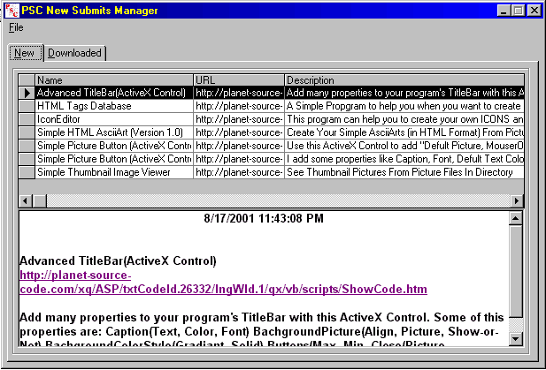



## PSC New Submittions Manager

### Description

If you are subscribed to Planet-Source-Code "Code of Day" Daily MailingList, you can use this simple program. Just save mails as HTML or TEXT files and load them with this program, then you can see new submitions list and download them, also you can manage downloaded codes ...
 
### More Info
 

             |
---                |---
**Submitted On**   |2001-10-20 23:30:26
**By**             |[Ali Amirnezhad](https://github.com/Planet-Source-Code/PSCIndex/blob/master/ByAuthor/ali-amirnezhad.md)
**Level**          |Intermediate
**User Rating**    |5.0 (15 globes from 3 users)
**Compatibility**  |VB 6\.0
**Category**       |[Complete Applications](https://github.com/Planet-Source-Code/PSCIndex/blob/master/ByCategory/complete-applications__1-27.md)
**World**          |[Visual Basic](https://github.com/Planet-Source-Code/PSCIndex/blob/master/ByWorld/visual-basic.md)
**Archive File**   |[PSC New Su2990510192001\.zip](https://github.com/Planet-Source-Code/ali-amirnezhad-psc-new-submittions-manager__1-28255/archive/master.zip)

